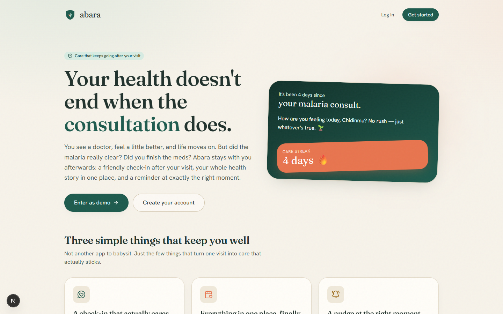
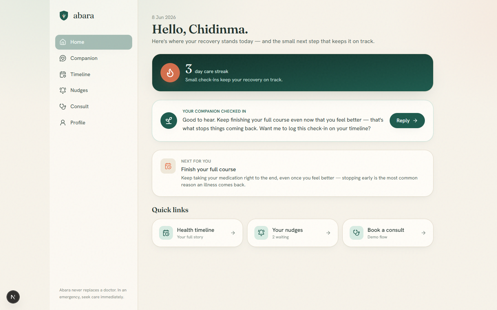
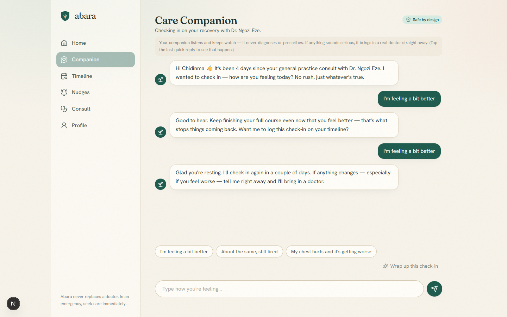
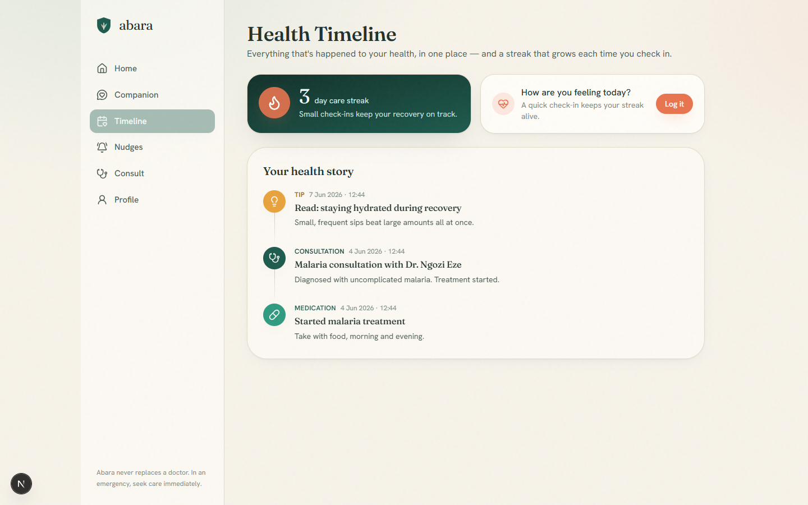
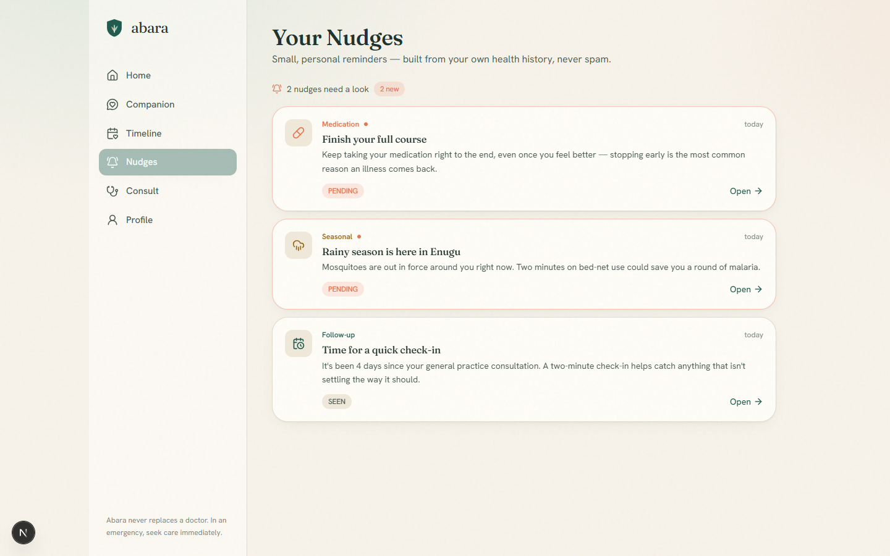
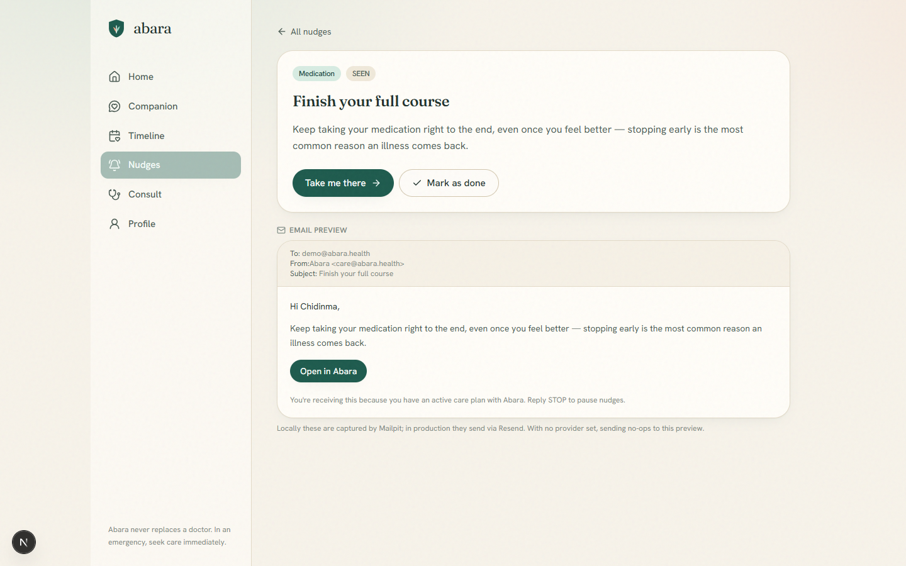
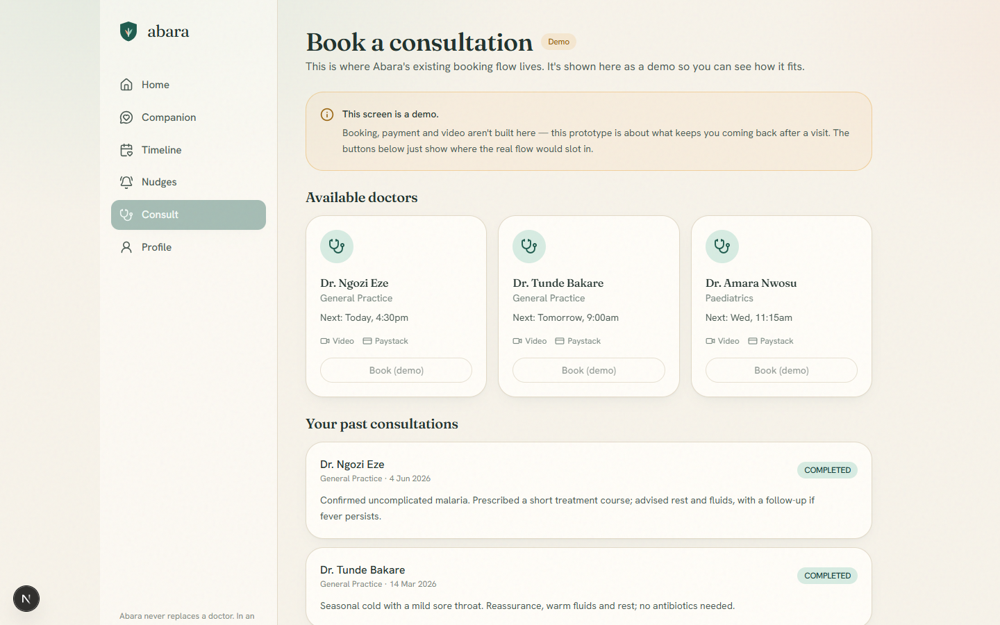
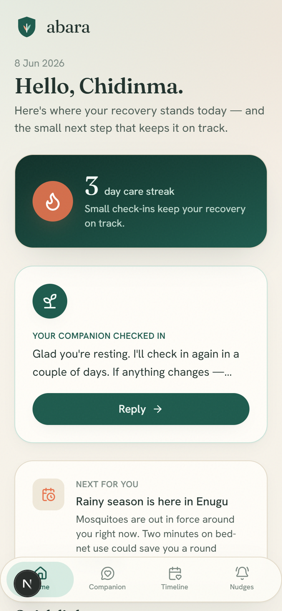
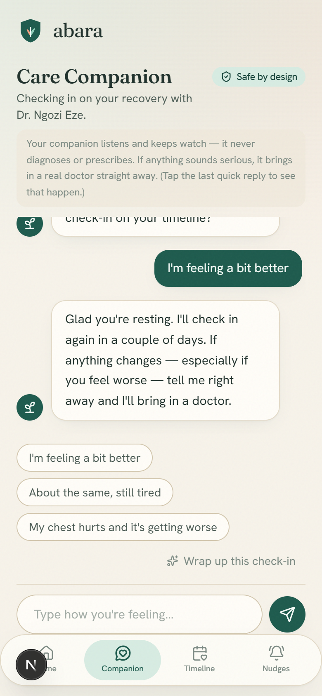

<div align="center">

# 🌿 Abara

### The care that keeps going after your visit.

Abara is the **retention layer** for a Nigerian telemedicine app — it turns a
one-time consultation into an ongoing health relationship.

<p>
  
  
  
  
  
  
</p>

<em>⚠️ This is a presentation prototype — a working core to demonstrate the idea, not a finished production build.</em>

</div>

<br />



---

## The problem

Most telemedicine apps are built for the *one* moment you're sick. You book,
see a doctor, feel a bit better — and disappear. Abara's real challenge is
**retention**: people use it once in a crisis and never come back, because
nothing follows the consultation.

Abara is the layer that follows up. It turns a single visit into a relationship.

## What Abara does

| | Feature | What it is |
|---|---|---|
| 💬 | **Care Companion** | A gentle AI that checks in after your visit, asks how recovery is going — and the moment anything sounds serious, **stops and connects you to a real doctor**. It never diagnoses or prescribes. The safety boundary is enforced in code, not left to the model. |
| 📈 | **Health Timeline & Care Streaks** | Your whole health story as one living timeline — consultations, medications, check-ins, companion sessions — plus a streak that gently rewards you for showing up. |
| 🔔 | **Smart Health Nudges** | Timely, personal reminders built from your *own* history: a follow-up that's due, a course to finish, malaria season arriving in your area. Each one deep-links to what to do next. |

---

## ⚠️ About this prototype

This repository is a **prototype built for presentation** — a complete, runnable
*core*, not a shipped product. It demonstrates the retention concept end-to-end:
real auth, database, AI streaming, and the safety guardrail all work.

**Intentionally out of scope** (the existing telemedicine app already handles
these; they are stubbed or omitted here):

- 💳 Real payments (Paystack)
- 📹 Live video consultation
- 📱 WhatsApp delivery (email is the prototype stand-in)
- 🗓️ Real booking — the Consult screen is a labelled visual stub

The app runs fully **without** an AI or email key — the companion falls back to
safe canned replies and email no-ops to an in-app preview.

---

## A look around

<table>
  <tr>
    <td width="50%"><br/><sub><b>Dashboard</b> — greeting, care streak, your companion's latest check-in, what's next.</sub></td>
    <td width="50%"><br/><sub><b>Care Companion</b> — streaming AI check-in with a hard safety boundary.</sub></td>
  </tr>
  <tr>
    <td width="50%"><br/><sub><b>Health Timeline</b> — a living record + check-in to grow your streak.</sub></td>
    <td width="50%"><br/><sub><b>Nudges</b> — personal reminders drawn from your own history.</sub></td>
  </tr>
  <tr>
    <td width="50%"><br/><sub><b>Nudge detail</b> — deep-link CTA and an email preview.</sub></td>
    <td width="50%"><br/><sub><b>Consult</b> — a clearly-labelled stub for the existing booking flow.</sub></td>
  </tr>
</table>

### Mobile-first

<p>
  
  
</p>

---

## How it works

- **Safety guardrail in code.** A deterministic, framework-free detector
  (`src/lib/escalation.ts`) is the single source of truth used by the chat UI,
  the server route, and the tests. On any red-flag signal the companion stops
  triage, surfaces "Connect with a doctor," and the thread is closed and logged
  to the timeline — it never relies on the model to police itself.
- **Pure service layer.** Business logic (streak rules, nudge generation,
  companion summaries) lives in framework-free functions under `src/services/`,
  so it's trivially unit-tested. Server actions and route handlers are thin
  wrappers that validate with Zod and return typed results.
- **Never an empty app.** One `seedStarterDataForUser()` service seeds both the
  demo account and every real signup, so the retention features are alive on
  first load.
- **Streaming, with graceful degradation.** The companion streams Gemini over
  SSE, with retry/backoff and a safe canned fallback if the key is missing or
  rate-limited.

```
src/
  app/            # routes (App Router) + /api companion SSE & nudge generation
  components/     # design system + nav + motion
  features/       # auth · care-companion · timeline · nudges
  services/       # PURE business logic (unit-tested)
  server/         # server actions + data services (integration-tested)
  lib/            # prisma, gemini, email, auth, schemas, escalation guardrail
prisma/           # schema, migrations, seed
tests/            # unit (jsdom) + integration (real test DB)
```

## Tech stack

Next.js 16 (App Router, RSC, Server Actions) · TypeScript (strict) · Tailwind v4
· Framer Motion · Zustand · React Hook Form + Zod · Prisma + PostgreSQL · jose +
bcryptjs (JWT in an httpOnly cookie) · Google Gemini · Nodemailer / Resend ·
Jest + React Testing Library.

## Run it locally

```bash
corepack enable pnpm        # one-time: makes pnpm available
pnpm install
docker compose up -d        # Postgres (5434), test DB (5435), Mailpit (8026)
cp .env.example .env        # then set JWT_SECRET (GEMINI/RESEND keys optional)
pnpm db:migrate             # apply the schema
pnpm db:seed                # create the demo account + starter data
pnpm dev                    # → http://localhost:3000
```

> **Demo login:** tap **“Enter as demo”** on the landing page, or sign in with
> `demo@abara.health` / `demo1234`.

See [`SETUP.md`](./SETUP.md) for the Gemini, Render Postgres, email, and Vercel
deployment guides.

## Tests

```bash
pnpm test              # unit + integration   (test DB must be up)
pnpm test:unit         # components, hooks, pure services
pnpm test:integration  # full-flow against the test database
pnpm typecheck && pnpm lint
```

**89 tests** cover the escalation guardrail (full trigger set), auth (signup /
login, happy + error paths), streak rules, nudge generation + transitions, and
companion sessions.

## Deploy

Vercel (app) + Render (Postgres). Push to GitHub → import in Vercel → set env
vars (point `DATABASE_URL` at Render's external URL) → run
`prisma migrate deploy` and `pnpm db:seed` against the production DB. Step-by-step
in [`SETUP.md`](./SETUP.md).

---

<div align="center">
<sub>Abara supports care between visits — it never replaces a doctor. In an emergency, seek medical help immediately.</sub>
</div>
